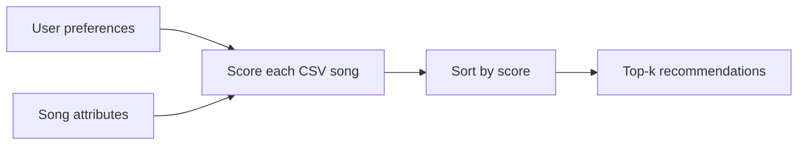

# Music Recommender Simulation

## Project Summary

VibeBridge 1.0 is a CLI-first, content-based music recommender. It compares a listener's favorite genre, preferred mood, and target energy with an 18-song fictional catalog. It scores every song, ranks the catalog, and explains why each top result was selected.

## How The System Works

Large streaming services may combine collaborative filtering, which learns from similar users' likes, skips, and playlists, with content-based filtering, which examines song attributes. This classroom version uses content-based filtering because it has song information but no real user histories.

Each song stores an ID, title, artist, genre, mood, energy, tempo, valence, danceability, and acousticness. The functional user profile contains a preferred genre, mood, and energy target. The object-oriented profile also records whether the listener likes acoustic music.

### Algorithm Recipe

- Exact genre match: **+2.0 points**
- Exact mood match: **+1.0 point**
- Energy similarity: **up to +1.0 point**, calculated as `1 - absolute energy difference`
- Rank every song from highest to lowest score and return the top `k`

Energy similarity rewards closeness to the user's target, not simply high energy. A scoring rule judges one song, while the ranking rule sorts all judged songs to create recommendations. A likely bias is that genre receives the largest weight and may reduce discovery outside a listener's stated favorite genre.



## Getting Started

1. Optional: create and activate a virtual environment.

   ```bash
   python -m venv .venv
   ```

2. Install dependencies.

   ```bash
   pip install -r requirements.txt
   ```

3. Run the recommender.

   ```bash
   python -m src.main
   ```

4. Run the tests.

   ```bash
   pytest
   ```

## Sample Recommendation Output

### High-Energy Pop

```text
1. Sunrise City by Neon Echo - Score: 3.98
   Because: genre match (+2.0); mood match (+1.0); energy similarity (+0.98)
2. Golden Hour Drive by Solar Avenue - Score: 3.88
   Because: genre match (+2.0); mood match (+1.0); energy similarity (+0.88)
3. Gym Hero by Max Pulse - Score: 2.87
   Because: genre match (+2.0); energy similarity (+0.87)
4. Rooftop Lights by Indigo Parade - Score: 1.96
   Because: mood match (+1.0); energy similarity (+0.96)
5. Night Drive Loop by Neon Echo - Score: 0.95
   Because: energy similarity (+0.95)
```

### Chill Lofi

```text
1. Library Rain by Paper Lanterns - Score: 4.00
   Because: genre match (+2.0); mood match (+1.0); energy similarity (+1.00)
2. Midnight Coding by LoRoom - Score: 3.93
   Because: genre match (+2.0); mood match (+1.0); energy similarity (+0.93)
3. Focus Flow by LoRoom - Score: 2.95
   Because: genre match (+2.0); energy similarity (+0.95)
4. Spacewalk Thoughts by Orbit Bloom - Score: 1.93
   Because: mood match (+1.0); energy similarity (+0.93)
5. Coffee Shop Stories by Slow Stereo - Score: 0.98
   Because: energy similarity (+0.98)
```

### Deep Intense Rock

```text
1. Storm Runner by Voltline - Score: 3.99
   Because: genre match (+2.0); mood match (+1.0); energy similarity (+0.99)
2. Fire in the Static by Crimson Circuit - Score: 3.97
   Because: genre match (+2.0); mood match (+1.0); energy similarity (+0.97)
3. Gym Hero by Max Pulse - Score: 1.97
   Because: mood match (+1.0); energy similarity (+0.97)
4. Electric Horizon by Prism State - Score: 0.94
   Because: energy similarity (+0.94)
5. Sunrise City by Neon Echo - Score: 0.92
   Because: energy similarity (+0.92)
```

### Conflicted Edge Case

```text
1. Gym Hero by Max Pulse - Score: 2.97
   Because: genre match (+2.0); energy similarity (+0.97)
2. Sunrise City by Neon Echo - Score: 2.92
   Because: genre match (+2.0); energy similarity (+0.92)
3. Golden Hour Drive by Solar Avenue - Score: 2.78
   Because: genre match (+2.0); energy similarity (+0.78)
4. Velvet Goodbye by Mara Blue - Score: 1.58
   Because: mood match (+1.0); energy similarity (+0.58)
5. Storm Runner by Voltline - Score: 0.99
   Because: energy similarity (+0.99)
```

## Experiments You Tried

The normal weights make genre twice as important as mood. I compared that design with a weight-shift experiment that reduced genre from 2.0 to 1.0 and doubled energy similarity from 1.0 to 2.0. The experimental version would make songs with similar intensity more competitive across genres, improving discovery but weakening the importance of a user's favorite genre.

The profiles also demonstrated meaningful changes. Chill Lofi ranks low-energy lofi songs first, whereas Deep Intense Rock shifts to high-energy rock. High-Energy Pop favors happy pop tracks. The conflicted profile asks for pop, sadness, and high energy; it exposes a surprising result because three non-sad pop songs outrank the sad R&B track. This happens because genre is worth more than mood.

## Limitations and Risks

The catalog is tiny and uneven, so profiles for well-represented genres receive more choices. Exact text labels cannot understand related genres or moods. The recommender does not learn from likes, skips, listening context, lyrics, culture, or changing taste. Its strong genre weight may create a filter bubble by repeatedly favoring familiar music.

## Reflection

I learned that recommenders transform features and preferences into predictions through mathematical choices. Even a short scoring formula can feel personal when its top result matches a listener's expectations. However, the conflicted profile showed that every weight encodes a decision: emphasizing genre can make the program overlook a better mood match.

AI tools helped me brainstorm diverse data, create edge cases, and structure the scoring logic. I still needed to check the numeric conversions, verify the scoring math, run the code and tests, and decide whether the rankings made sense. If I extended the project, I would collect feedback over time, use more audio features, and add a diversity rule so the recommendations encourage discovery.

See [model_card.md](model_card.md) for the full evaluation and responsible-use discussion and [ai_interactions.md](ai_interactions.md) for the AI workflow log.
